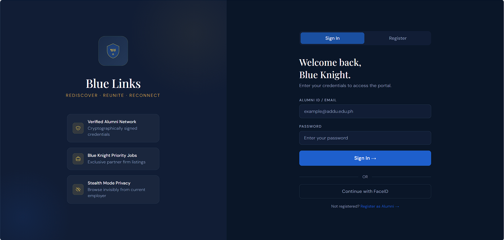
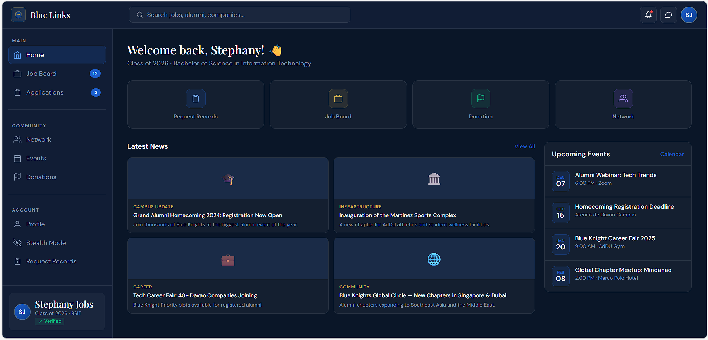
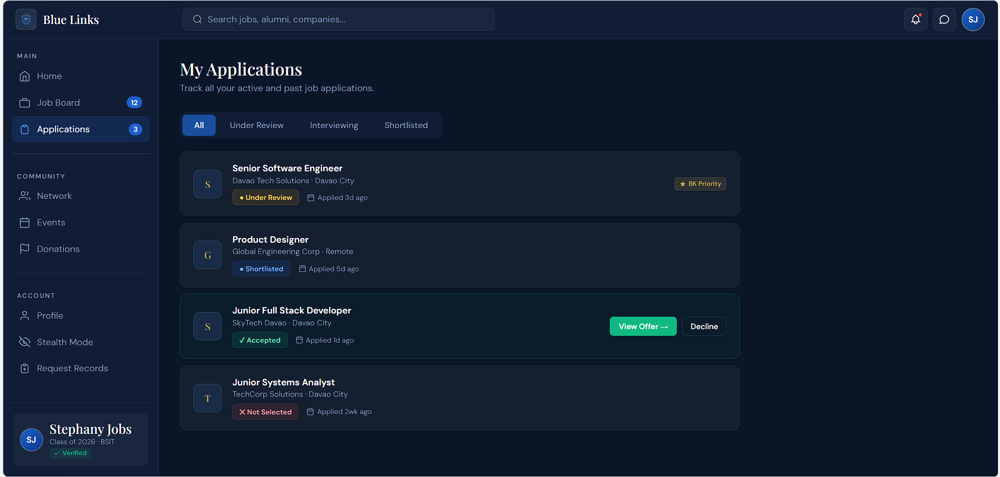
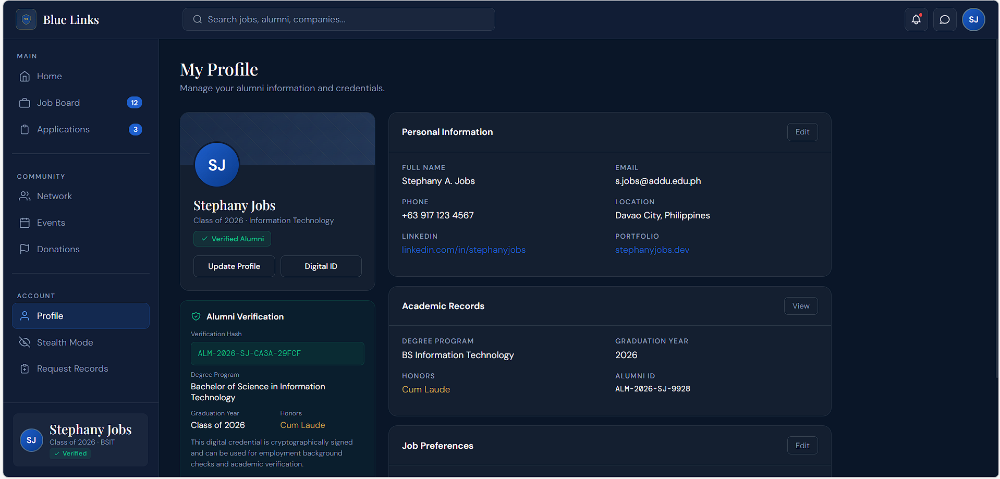
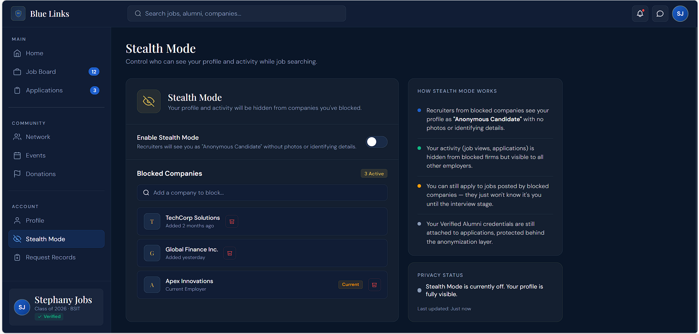
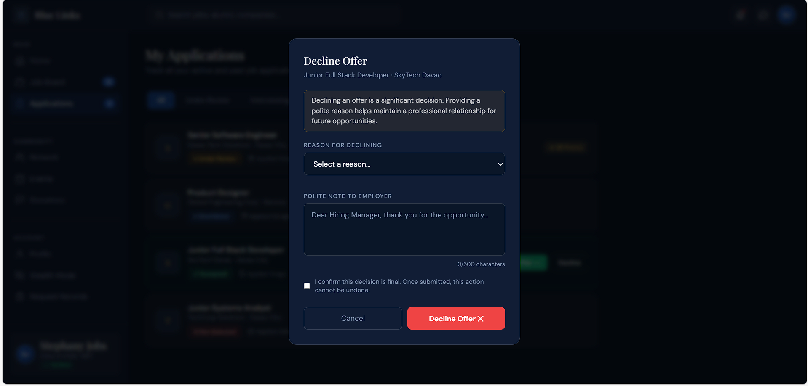

# Delos Reyes
**Framework:** Vue JS  
**Assigned Module:** Module 4

# 🛡️ Blue Links: Ateneo Alumni Command Center

> **Project Mission:** Transitioning the "Blue Links" mobile portal into a powerful, responsive desktop "Command Center" using Vue 3, Pinia, and Tailwind CSS.

---

## 🚀 Quick Start & Installation

To simulate this project on another machine, follow these steps:

### 1. Prerequisites
Ensure you have **Node.js (v18.0 or higher)** installed. You can check your version by running:
```bash
node -v
2. Clone and Install
Bash

# Clone the repository
git clone [https://github.com/yourusername/blue-links-vibe.git](https://github.com/yourusername/blue-links-vibe.git)

# Enter the directory
cd blue-links-vibe

# Install necessary dependencies (Vue, Vite, Tailwind, Pinia)
npm install
3. Run the Simulation
Bash

# Start the development server
npm run dev

```


# AI Tools Used
Gemini (prompt)

Claude

# Prompt
Role: You are my Lead Vue.js Engineer. I have provided mobile screenshots for "Blue Links," an alumni portal for Ateneo de Davao. Your mission is to help me build a responsive web version of this app using Vue 3 (Composition API), Vite, and Tailwind CSS.

The Objective: We are participating in an AI comparison study. I need you to demonstrate your unique "Claude Vibe"—showcasing your ability to handle complex UI layouts, nuanced state management, and superior documentation.

Task 1: Desktop Extrapolation & Vibe

How will the "Job Board" and "Profile" sidebars look on a wide screen?

Suggest a "Modern Academic" aesthetic that feels professional yet high-tech.

Task 2: Component Architecture

LoginView.vue & RegistrationView.vue (Auth flow)

JobDashboard.vue (The main feed with filters)

ApplicationDetail.vue (The specific job view with the "Under Review" status)

StealthModeSettings.vue (The privacy toggle interface)

Task 3: GitHub & README Mastery

Propose a GitHub README.md structure that highlights our "AI-Human Collaboration."

Explain the "Vibe & Logic" for desktop transition and the "Verification Tech" for cryptographic hashes.

(Used a PDF containing images and flow of the mobile version of the App)


### Master Prompt Used
> "I have a single-file HTML app called blue-link.html for an Ateneo de Davao alumni portal. It uses vanilla HTML, CSS, and JavaScript — no framework. Help me convert it into a fully installable, offline-ready Progressive Web App. I need: (1) a manifest.json with Ateneo navy #0E1E36 theme and gold #C9A84C accent, (2) a service worker sw.js using Cache-First strategy for all static assets, and (3) the correct script tag to register the SW in my HTML file. The app should load instantly offline after first visit."


### AI Hallucinations / Manual Fixes
| Issue | Fix |
|-------|-----|
| SW tried to cache relative URLs without a base — failed silently | Changed all paths to absolute `/blue-link.html` format |
| `manifest.json` used `"display": "fullscreen"` — hides browser chrome on iOS | Changed to `"standalone"` for correct behavior |


# Screenshots
All original design assets are located in the images/ folder.

### 1. Login & Registration

 

### 1. Dashboard of the website

  

### 1. Applications section



### 1. Profile section of the user



### 1. Stealth Mode



### 1. Decline Offer


